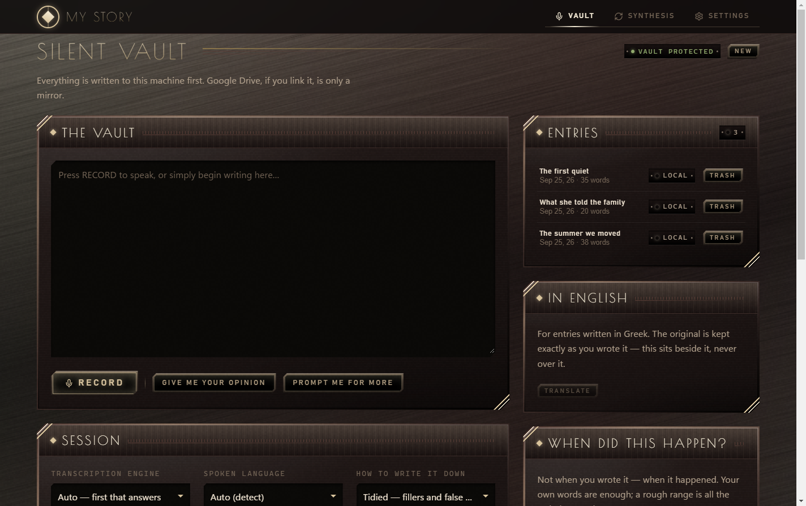
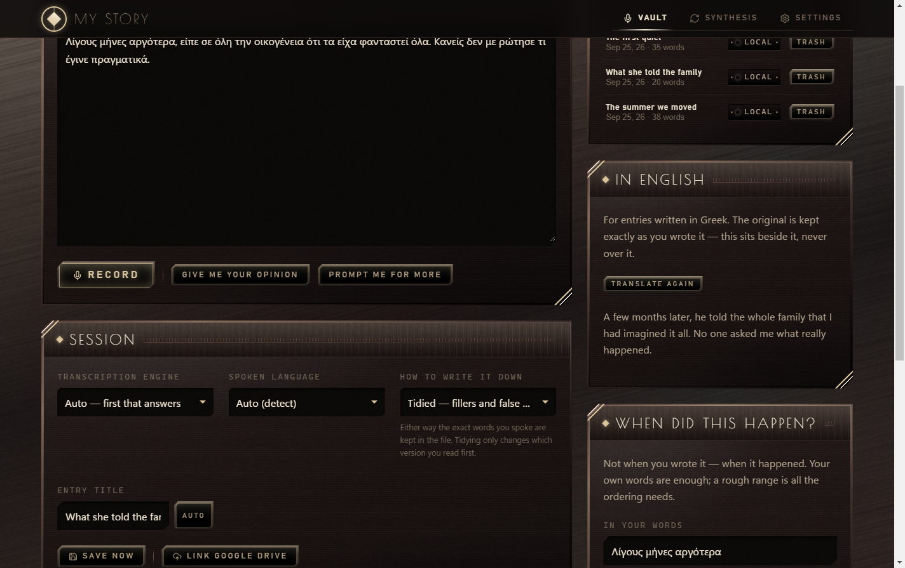
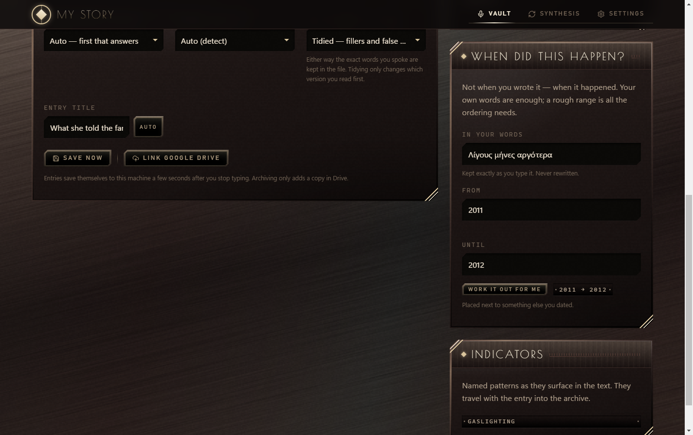
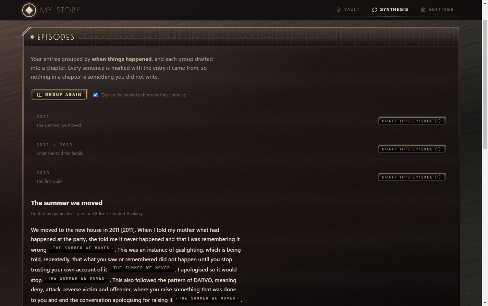
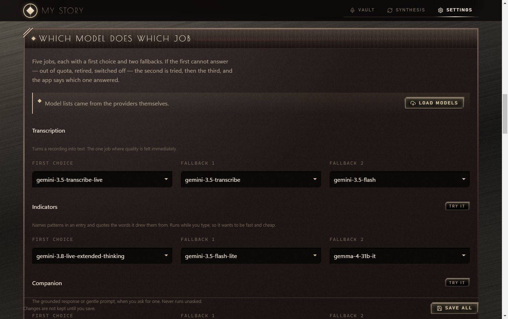

# My Story — a private, self-hosted journal for recording your own life

[](https://github.com/Stravelakis/mystory/actions/workflows/ci.yml)
[](LICENSE)
[](https://github.com/Stravelakis/mystory/releases/latest)



**Speak or write. It transcribes, keeps every word in a plain file on your own
computer, and helps you put your life back in order.**

A free, open-source, self-hosted journalling app for anyone who wants a record
of their own life that nobody else can read — built for people whose memory of
it is patchy, and who are tired of trusting an app company with the worst years
of it.

- **Nothing leaves your machine unless you say so.** There is a switch that
  makes that a guarantee rather than a promise: with local-only routing, the
  app will not contact a cloud provider even if a key is sitting in its
  settings, and it switches off Google Drive too.
- **Your entries are plain markdown files.** Readable in Notepad, backed up
  with a folder copy, and still yours if this project disappears tomorrow.
- **Runs on free AI, local AI, or your own keys.** Ollama or LocalAI on your
  own hardware, a free Google or Groq tier, or anything that speaks the OpenAI
  protocol. Six jobs, each with a first choice and two fallbacks.
- **Speaks Greek and English**, and keeps the original beside the translation.
- **Names what happened, and quotes you for it.** Gaslighting, DARVO,
  scapegoat, golden child, flying monkeys, fawn, gray rock — grouped by whether
  it was done to you, was a position you were put in, was how you survived, or
  was what protected you. Every label carries the sentence it came from, and a
  label it cannot quote for is dropped.
- **Drafts chapters you can check.** Every claim cites the entry it came from.

**[Download for Windows](https://github.com/Stravelakis/mystory/releases/latest)** ·
[Docs site](https://stravelakis.github.io/mystory/) (Dev, English and ELI5) ·
[GUIDE.md](GUIDE.md) if you have never installed anything before ·
[INSTALL.md](INSTALL.md) for the step by step.

| | |
|---|---|
|  |  |
|  |  |

> **This is a journal, not a clinician.** It names behaviours and dynamics —
> things that happened, and what they are commonly called. It does not diagnose
> anyone, it never speaks unless you press the button that asks it to, and it
> is not a substitute for care from a person. If you are in crisis, please
> reach one.

### Is this the thing you were looking for?

| You want | This app |
|---|---|
| A diary nobody else can read | Yes. One machine, one passcode, plain files. |
| To not hand your life to a company | Yes. That is the whole design. |
| To remember things in order | Yes — entries carry when they *happened*, not just when you typed them. |
| To write in Greek | Yes, with English beside it. |
| A therapist, or a crisis line | **No.** Please find a person. |
| Something you sign up for | **No.** There is nothing to sign up for, and nobody hosts it. |
| To sync across devices in the cloud | **No**, beyond an optional mirror into your own Google Drive. |

> **This is a journal, not a clinician.** It names behaviours and dynamics —
> things that happened, and what they are commonly called. It does not
> diagnose anyone, and it is not a substitute for care from a person.

---

## Install

**Windows:** run `My Story Setup x.y.z.exe` from the
[latest release](https://github.com/Stravelakis/mystory/releases/latest). It
installs per user and lists itself in Installed apps. Your entries and settings
live in `%APPDATA%\mystory` and stay there if you uninstall. There is also a portable
`.exe`. The installer is not code-signed yet, so SmartScreen will ask:
choose *More info → Run anyway*.

**From source, anywhere:** Node.js 20 or newer.

```bash
git clone https://github.com/Stravelakis/mystory.git
cd mystory
npm install
npm run dev
```

Open <http://localhost:38726>.

Or, with Docker:

```bash
touch .env && mkdir -p vault && docker compose up -d
```

Either way, do these things first:

1. **Settings → The lock.** Set a passcode. Until you do, anyone who can reach
   the port can read every entry, and the app says so on every screen and in
   the boot log.
2. **Settings → Where your words go.** Tick it only if you want cloud AI.
   Until it is ticked, no entry is sent to any cloud provider (DeepL
   included), and only models on your own machine are asked.
3. **Settings → Models.** Point it at a model. Nothing works until you do —
   though nothing is lost either: recordings are written to disk before any
   model is called.

For an always-on box and access from a phone, see [DEPLOY.md](DEPLOY.md).

---

## Where the models run

Every model is reached through an OpenAI-compatible endpoint, so a model
running on your own machine and a model running in someone else's datacentre
are configured the same way and are equally first-class.

| Routing | |
|---|---|
| **Cloud first** | cloud providers are asked first, a local runtime is the fallback |
| **Local first** | your own machine first, cloud only when it cannot answer |
| **Local only** | nothing leaves this machine — cloud providers are never asked, and Google Drive is refused while it is set |

**Local only is a guarantee, not a preference.** With it on, the cloud
providers are not tried, not fallen back to, and not reachable even with a key
sitting in `.env`, and the routes that would put an entry into Google Drive are
closed and say why.

### Running it entirely on your own machine

Any OpenAI-compatible runtime works. Two common ones:

**LocalAI** — one endpoint for both chat and transcription, which is why it is
listed first here.

```bash
local-ai run
```

| Settings → Models | |
|---|---|
| Where models run | `Local only` |
| Local models → Endpoint | `http://localhost:8080/v1` |
| Local models → Model | press **Load models** and pick one |
| Local transcription → Endpoint | `http://localhost:8080/v1` (once a Whisper model is installed) |

**Ollama** — no transcription of its own, so it needs a Whisper server beside it.

```bash
ollama serve && ollama pull llama3.1:8b
docker run -d -p 8000:8000 ghcr.io/speaches-ai/speaches:latest-cpu
```

| Settings → Models | |
|---|---|
| Local models → Endpoint | `http://localhost:11434/v1` |
| Local transcription → Endpoint | `http://localhost:8000/v1` |

LM Studio (`:1234`), llama.cpp's server (`:8080`), vLLM and whisper.cpp all
speak the same protocol and work the same way. Press **Load models** and the
Settings screen lists what each endpoint actually has, so you never type a name
from memory.

Inside Docker, the host is `host.docker.internal` rather than `localhost`.

**On small local models.** Indicator tagging is the hardest job here — it asks
for structured output with exact quotes. A reasoning model needs room to think
*and* answer, so the app gives that job a generous ceiling; a ceiling is not a
cost, since a model that answers in twenty tokens still costs twenty. If a
local model keeps returning nothing, the app now says which of those it is
rather than reporting an empty result. Assigning a non-reasoning model to
Indicators is usually the quickest fix.

### Which model does which job

Six jobs, each with a first choice and two fallbacks. If the first cannot
answer — out of quota, retired, switched off — the second is tried, then the
third, and the app reports which one answered.

| Job | Wants |
|---|---|
| **Transcription** | accuracy; the one job whose quality you feel immediately |
| **Indicators** | fast and cheap — it runs while you type |
| **Companion** | warmth; only ever runs when you press the button |
| **Titles** | the smallest job here |
| **Synthesis** | the one job worth a slow, expensive model |

**Model names are never guessed.** Press **Load models** in Settings and the app
asks every provider what it actually has — a plain listing that costs nothing.
Providers rename and retire models faster than any app ships, so a name copied
from a blog post is tomorrow's 404.

### Cloud providers

None are required and none are hardcoded into a feature: **Gemini**, **Groq**,
**Mistral**, **NVIDIA NIM**, **Cerebras**, **OpenRouter**, or any other
OpenAI-compatible endpoint you paste a URL for. Keys are written to `.env`
beside the app and are sent nowhere except to the provider they belong to.

An aggregator with a paid key is **opt-in only** — it is never used for a job
you have not explicitly assigned it to.

### If a Google key will not work

```bash
npm run gemini:doctor
```

It lists exactly which models that key can use, makes one real call, and
explains any failure in plain English. Worth knowing before you start guessing:

- an **invalid key** comes back as `400`, not `401` — so it reads like a
  malformed request when it is really a bad key
- `429` means both "slow down" and "this project has no money", and only one
  of those resolves by waiting
- `403` means both "the key is restricted" and "the Generative Language API is
  switched off on this project"

And the one that catches everybody: **attaching a project to Cloud billing turns
the free tier off.** If you want free-tier usage, use a key from a project with
no billing account. If you want to spend credit, the credit has to sit on the
billing account that project is linked to.

Gemini model names containing `live` or `transcribe` use a different protocol
(`bidiGenerateContent`, a streaming WebSocket) which this app does not speak.
They will not appear as assignable even when your key has them. That is correct,
not a bug.

---

## Where your writing lives

**This machine is the vault.** Entries are plain markdown with front matter in
`vault/`, owner-readable only and ignored by git:

```
vault/
  20260816-142530-a3f.md      one entry, readable by anything
  audio/20260816-142530-a3f.webm
  .trash/                     trashed entries land here
```

The order of operations is deliberate:

1. A recording is written to `vault/audio/` **before** any model is called, in
   whatever container the device produced, and an entry is created to hold it.
   If every transcription provider is down or unconfigured, you still have the
   recording.
2. Typed entries save themselves a few seconds after you stop typing, and are
   mirrored into `localStorage` immediately so a reload cannot cost you a
   half-written paragraph.
3. Only then is anything sent to Google Drive, and the link is recorded back
   onto the local entry. A failed or expired Drive token costs you a sync,
   never a memory.

Nothing in the app deletes anything: **Trash** moves the file into
`vault/.trash/`. Point `VAULT_DIR` somewhere else to relocate the vault, or set
`VAULT_KEEP_AUDIO=off` to stop retaining recordings.

Back it up by copying the folder. There is no database and nothing to migrate.

---

## The lock

There is no account system — one passcode, set under **Settings → The lock**.

- every `/api` route and the companion WebSocket require a session
- the session is a signed cookie, `HttpOnly`, good for 30 days, and survives a
  restart
- the passcode is stored **only** as a scrypt hash in `.env`. It cannot be read
  back out, which also means there is no recovery — write it down
- five wrong guesses from one address buys a minute of silence

Losing the passcode does not lose your writing: the entries are plain files.
Delete `APP_PASSCODE_HASH` from `.env` and restart to unlock. **The vault is
not encrypted at rest** — the passcode keeps other people off the port, and
full-disk encryption is what keeps them out of the folder.

---

## The vocabulary

The terms the app is allowed to put on your writing live in
[`vocabulary.ts`](vocabulary.ts), grouped by what they are *about*:

| | |
|---|---|
| **Done to me** | gaslighting, DARVO, hoovering, triangulation, smear campaign… |
| **Position in the system** | scapegoat, golden child, flying monkeys, lost child… |
| **How I survived it** | fawn, gray rock, freeze, hypervigilance, dissociation… |
| **What protected me** | boundary held, no contact, exit, witness, documentation… |

A flat list would make a category error. "Gaslighting" is something done to
you; "fawn" is something you did to survive it; "scapegoat" is a position you
were put in. Filing all three under one heading turns a coping response into a
symptom.

Every term carries a plain definition, shown beside the tag, and the model is
required to quote the words it drew the term from — a term it cannot quote for
is dropped. Someone else's family did not work like yours, so the whole list is
replaceable: point `INDICATORS_FILE` at a JSON file of your own and none of
these terms apply to you any more.

---

## Google Drive

Optional, off under local-only routing, and never required. Nothing is uploaded
until you archive an entry.

The server holds a **refresh token** and mints access tokens as it needs them;
the browser never receives a Google credential. Scope is `drive.file` — access
to files this app creates, and nothing else in your Drive.

Setting it up is a one-time job in the
[Google Cloud console](https://console.cloud.google.com/apis/credentials):

1. Create an OAuth client, type **Web application**.
2. Add an authorised redirect URI ending in `/auth/callback`.
3. Paste the client ID and secret into **Settings → Google account**, save,
   then **Link**.

**On the redirect URI:** Google accepts `http://localhost` or any `https`
origin, but not `http://` on a private address — so
`http://100.x.x.x:38726/auth/callback` is rejected. Either register
`http://localhost:38726/auth/callback` and link once from a browser on the
machine itself (or through `ssh -L 38726:localhost:38726`), or put the app behind
a Tailscale HTTPS hostname and register that. The link survives restarts.

---

## On a phone

The interface is responsive and installable — **Add to Home Screen** gives it
its own icon, full screen, and no address bar in the way of a recording.

**Recording from a phone needs https.** Browsers do not grant the microphone on
a plain `http://` origin that is not localhost, so a Tailscale HTTPS hostname
is the practical route in. [DEPLOY.md](DEPLOY.md) has the three commands.

Safari on iOS records MP4 where Chrome and Firefox record WebM; the app asks
the device what it can produce and carries that through, so recordings from a
phone are stored and transcribed in whatever container they actually arrived
in.

---

## Scripts

| | |
|---|---|
| `npm run dev` | Express + Vite middleware, port 38726 |
| `npm run build` | client into `dist/`, server into `dist/server.cjs` |
| `npm start` | run the built server |
| `npm run lint` | `tsc --noEmit` |
| `npm run desktop` | build, then open the Electron window (`desktop:browser` opens your browser instead) |
| `npm run build-exe` | the Windows installer and portable `.exe`, into `release/` |
| `npm run gemini:doctor` | list the Gemini models your key can actually reach |

No test suite yet. CI runs the typecheck, the build and a gitleaks scan of the
whole history.

## Look

The interface is **Deco Noir** — art-deco geometry under a noir key light. It
is vendored, not depended on: [`src/styles/deco-noir.css`](src/styles/deco-noir.css)
and `deco-noir.js` are copies, and the identity survives without the script.

- colourway `oxblood`, dress `full` — set on `<html>` in `index.html`
- Tailwind is loaded **without** Preflight and is used for layout only; every
  colour comes from a Deco Noir token
- the signature is a chamfer on two opposing corners, top-left and
  bottom-right. If you add a component, it gets `.cut` / `.cut-sm` too
- [`src/styles/mobile.css`](src/styles/mobile.css) holds the phone-only
  concerns and is loaded after the identity, so it can only ever adjust it

## Setting it up with an agent

If you use the Claude Chrome extension (or any agent that can drive a browser),
this saves clicking through Settings by hand. Open My Story in a tab, open the
extension, and paste this.

It is written to be safe to hand to an agent: it never asks it to read, type or
invent a credential, and it tells it to stop rather than improvise.

```text
You are looking at My Story, a private journalling app, open in this tab.
Help me finish setting it up. Work only inside this tab.

Never type or read an API key. Any key I have already set will show as a
masked value like ***. Leave every masked field exactly as it is — retyping
one replaces a working key with a broken one.

Do this in order, and tell me what you see at each step:

1. Go to the Settings tab.

2. THE LOCK. If it says no passcode is set, stop and tell me. I will type the
   passcode myself — do not invent one, and do not type into that field.

3. MODELS → "Where models run". Tell me which of the three it is on. Leave it
   alone unless I say otherwise. If it is on "Local only", say so, because
   that switches Google Drive off and refuses every cloud provider.

4. If I have told you an endpoint to use — a local runtime such as Ollama, or
   a gateway — put it in the matching Endpoint field. Otherwise skip this.

5. Press "Load models" and wait for it to finish. Then read back to me, for
   each provider: its name, whether it answered, and how many models it found.
   Quote any error exactly rather than summarising it.

6. In "Which model does which job", tell me what each of the five jobs is set
   to. If a job has no first choice, tell me what the dropdown offers and let
   ME pick. Do not choose a model on my behalf: they differ in cost, speed and
   whether they run on my own machine.

7. Once I have confirmed the choices, press "Save".

8. Press "Try it" on Indicators, Companion, Titles and Synthesis in turn.
   Report exactly which provider and model answered each one. If any fails,
   quote the whole message.

Do not change anything I have not listed. Do not press Trash, Unlink, or
anything under Google account. If something looks wrong, stop and ask me
rather than fixing it yourself.
```

Transcription is the one thing that prompt cannot verify, because it needs real
speech. Press **RECORD**, say a sentence, and stop — if the transcript comes
back, the chain works.

## Documentation

| | For |
|---|---|
| [GUIDE.md](GUIDE.md) | never installed anything before — the friendly version |
| [INSTALL.md](INSTALL.md) | step by step, including what goes wrong |
| [DEPLOY.md](DEPLOY.md) | an always-on box, and reaching it from a phone |
| [HANDOFF.md](HANDOFF.md) | working on the code |
| [CONNECT-AGENTS.md](CONNECT-AGENTS.md) | pointing Claude Code or a script at the running app |
| [STANDARDS.md](STANDARDS.md) | contributing — what "done" means, and why |

## Licence

[Apache 2.0](LICENSE), with attribution required on redistribution — see
[NOTICE](NOTICE), which explains in plain English what you must keep and when
it applies. Short version: run it, change it, keep it. If you pass it on, the
credit travels with it.
